<div align="center">

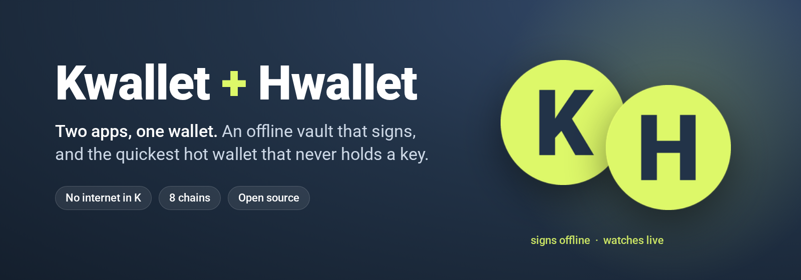

### An offline vault that signs, and the quickest hot wallet that never holds a key.

[](https://github.com/0xkabeno/Kwallet/releases/latest)
[](https://github.com/0xkabeno/Kwallet/actions/workflows/build.yml)
[](LICENSE)
[](hwallet/LICENSE)


[**Download**](#downloads) · [How it works](#how-signing-works) · [Screenshots](#screenshots) · [Security](#security-model) · [Build](#build-from-source)

</div>

---

## Two apps, one wallet

| | **Kwallet** — the vault | **Hwallet** — the hot wallet |
|---|---|---|
| Role | Fully secure offline wallet. Creates, stores and **signs** | The quickest hot wallet. Watches, prepares and **broadcasts** |
| Internet | **None.** The APK has no `INTERNET` permission | Public nodes for prices, balances, history and broadcast |
| Keys | Recovery phrases and private keys, encrypted on the device, never leave it | **Public addresses only.** Never sees a key |
| Signing | Every transaction, on its own sign page: check every detail, hold to sign | Asks Kwallet on the same phone and waits for the signed result |
| Live data | Receives live fee, price and balance updates from Hwallet while its sign page is open | Live prices, balances, activity, incoming alerts, background service |
| License | MIT | GPL-3.0 (layout and tools follow Gem Wallet) |

Kwallet works alone, as an Android app or as one HTML file you open with the network unplugged. Add Hwallet on the same phone when you want a fast, live wallet without ever putting a key online.

## How signing works

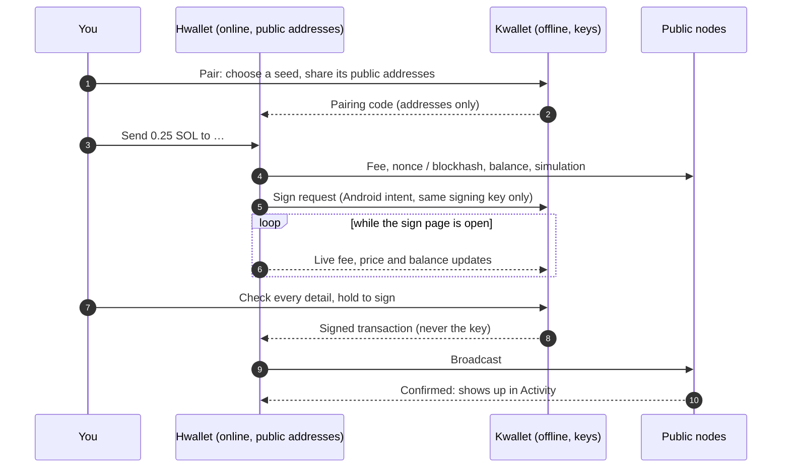

Both apps must come from the same release (same signing key). Kwallet refuses any other caller, and Hwallet only accepts results from Kwallet.

## Screenshots

| | Hwallet home | Activity | Scanner | Settings | Kwallet sign page | Opening |
|---|---|---|---|---|---|---|
| **Light** | 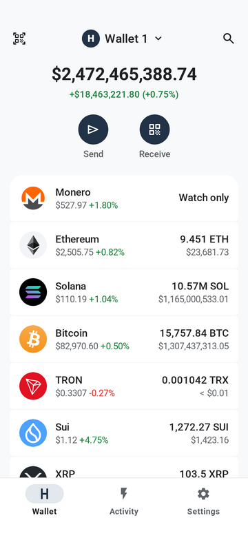 | 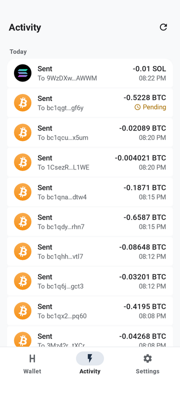 | 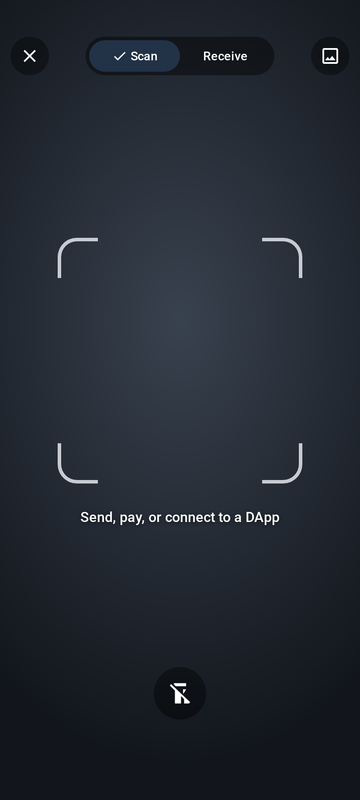 | 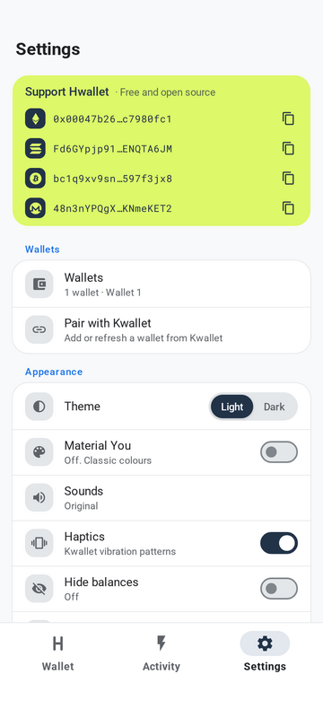 | 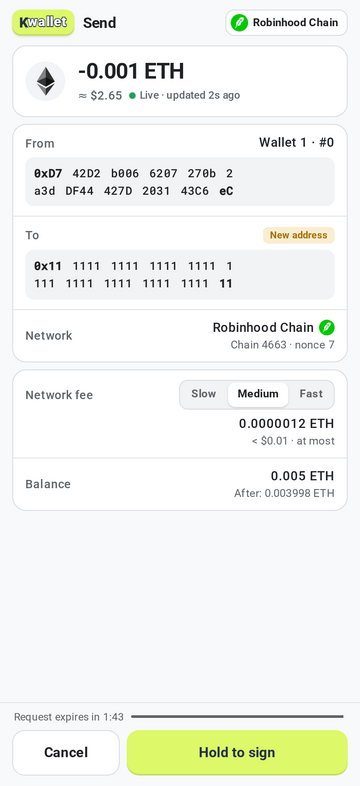 | 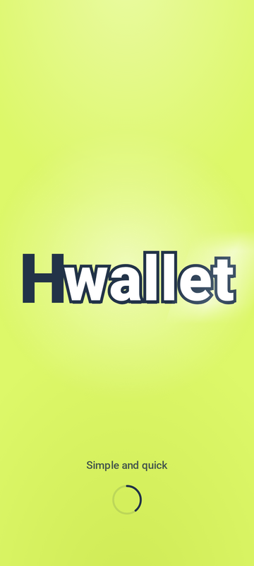 |
| **Dark** | 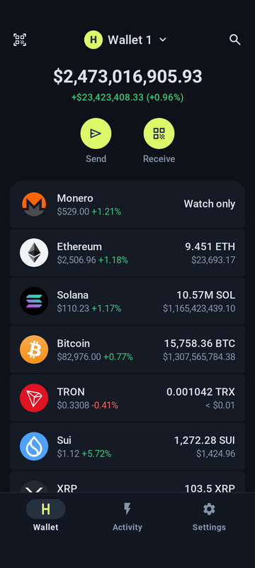 | 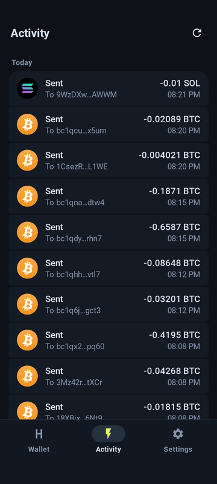 | 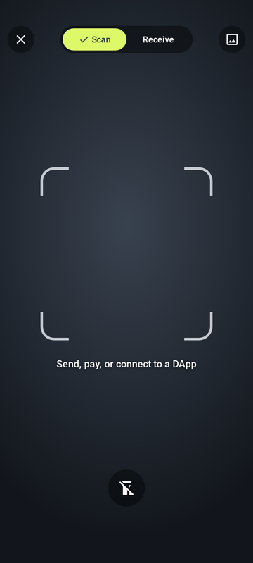 | 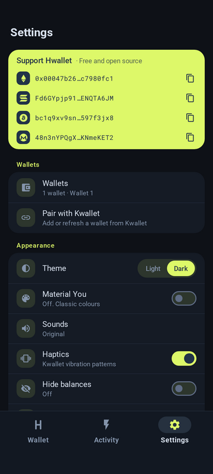 | 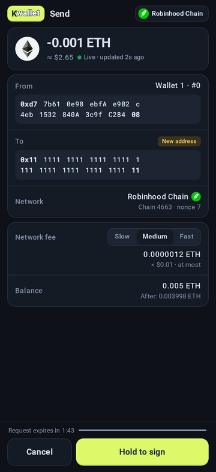 | 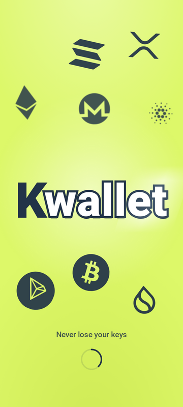 |

<sub>Taken from the v3.95 / v1.5 build with a public test address. The scanner shows a stand-in where the camera picture goes.</sub>

## Features

### Kwallet — the offline vault

- **Generate or import** 12–24 word BIP39 phrases, with optional passphrase (25th word)
- **Find** — paste any address or part of one and Kwallet scans every common wallet path to locate it
- **Key** — paste a single private key to see its ETH, TRX, BTC and SOL addresses
- **Backup & restore** — full-state backup file, optionally AES-256-GCM encrypted (PBKDF2 600k)
- **Export** — PDF, CSV and JSON, saved to `Download/Kwallet` on Android
- **App lock** — 6-digit PIN, auto-lock timer, two-step *Erase everything*
- **Built-in self-test** — known-answer vectors for every chain in *Log → Verify*
- **Clipboard auto-clear**, haptics, light and dark themes, smooth 120 Hz scrolling
- **Hwallet signer** — one sign page for every chain: decoded amounts, addresses in tidy blocks, live fee and balance, a fee-change re-arm, a countdown, and hold to sign
- **Never online** — no `INTERNET` permission; the HTML build works with the network unplugged

### Hwallet — the quickest hot wallet

- **Live everything** — prices, balances and full on-chain history (sent and received, endless scroll) on ETH and EVM networks (Base, Arbitrum, Optimism, Polygon, BNB Chain, Linea, Robinhood Chain, Arc), SOL, BTC, TRX, SUI, XRP and ADA, from free public nodes
- **Instant Activity** — a background service writes every chain's history to an on-device cache, so the tab opens with no network call
- **Own QR scanner** — CameraX with on-device decoding (no Google services): torch, scan from a photo, Scan / Receive tabs; addresses and payment links (`bitcoin:`, `ethereum:`, `solana:`, `tron:` with amount) open a prefilled Send
- **Clipboard paste chip** — Send offers "Paste <address> (Chain)" when you copied a valid address
- **Mobile data speed limit** — cap Hwallet's traffic on mobile data from 1 KB/s up to unlimited; **Wi-Fi is never limited**, and the limit switches live when the network changes
- **Gem-style design** with Kwallet's themes (light, dark, Material You), sounds and haptics; fixed bottom bar with a sliding pill; Settings as a full page
- **Several wallets**, tokens on every chain, TRON Energy / Bandwidth and Stake 2.0, XRP trust lines, Cardano native assets
- **Always-on service** with a live BTC / ETH / SOL / XMR notification and incoming-payment alerts
- **Crash prompt** — if Hwallet ever closes unexpectedly, the next launch offers to copy the log (once per crash)
- XMR is watch-only; XMR send is coming soon

## Supported chains

| Chain | Paths | Compatible with |
|---|---|---|
| **ETH / EVM** | `m/44'/60'/0'/0/i`, Ledger Live, Ledger legacy | MetaMask, Trust, Ledger |
| **BTC** | SegWit (84), Taproot (86), Nested SegWit (49), Legacy (44) | Electrum, Sparrow, BlueWallet |
| **SOL** | `m/44'/501'/i'/0'` and variants | Phantom, Solflare, Ledger |
| **TRX** | `m/44'/195'/0'/0/i`, Ledger Live | TronLink, Ledger |
| **SUI** | `m/44'/784'/i'/0'/0'` | Sui Wallet, Phantom, Slush |
| **XRP** | `m/44'/144'/0'/0/i` | Xaman, Trust |
| **ADA** | CIP-1852 (Icarus) | Yoroi, Eternl, Lace |
| **XMR** | Monero 25-word & Polyseed | Monero GUI, Cake, Feather |

Hwallet also follows EVM tokens on Base, Arbitrum, Optimism, Polygon, BNB Chain, Linea, Robinhood Chain and Arc.

## Downloads

Get the latest files from **[Releases](https://github.com/0xkabeno/Kwallet/releases/latest)**:

| File | What it is |
|---|---|
| [`Kwallet-vX.apk`](https://github.com/0xkabeno/Kwallet/releases/latest) | Kwallet for Android (no internet permission) |
| [`Kwallet-vX.html`](https://github.com/0xkabeno/Kwallet/releases/latest) | Kwallet as one HTML file: open it in any browser, offline |
| [`Hwallet-vX.apk`](https://github.com/0xkabeno/Kwallet/releases/latest) | Hwallet for Android (pairs with Kwallet on the same phone) |
| [`Hwallet-vX.html`](https://github.com/0xkabeno/Kwallet/releases/latest) | Hwallet in a browser (balances; signing needs the Android apps) |
| [`SHA256SUMS.txt`](https://github.com/0xkabeno/Kwallet/releases/latest) | Checksums for every file |

**Verify before you install:**

```bash
# put the downloads and SHA256SUMS.txt in one folder, then
sha256sum -c SHA256SUMS.txt --ignore-missing      # every line must say OK
# Android: both APKs must carry the same signing certificate
apksigner verify --print-certs Kwallet-v3.95.apk | grep SHA-256
apksigner verify --print-certs Hwallet-v1.5.apk  | grep SHA-256
```

On Android, open the APK and allow *Install unknown apps* once. Updates install over the previous version (same permanent key).

## Security model

- **Keys stay in Kwallet.** Phrases and private keys are encrypted at rest (AES-256-GCM, PIN or biometrics) and never leave the app. The Android build has no `INTERNET` permission, so it cannot send anything anywhere.
- **Hwallet is watch-only.** It stores public addresses and talks to public nodes. A compromised Hwallet can show wrong numbers, but it cannot sign: Kwallet decodes every request itself and shows what will really be signed.
- **One caller, one key.** Kwallet only answers sign requests from an app signed with the same key, and the live-data channel is protected by a signature-level permission.
- **Check, then hold.** The sign page shows the decoded chain, amounts, recipient, fee and balance; a fee change re-arms the button; requests expire.
- **Reproducible checks.** Every release runs 146 chain signer tests and 37 independent decode checks of Kwallet's signed output (ethers, @solana/web3.js, bitcoinjs-lib, ripple-binary-codec, cardano-serialization-lib, TronWeb, Sui SDK).

See [SECURITY.md](SECURITY.md) to report a problem.

## Build from source

```bash
git clone https://github.com/0xkabeno/Kwallet.git && cd Kwallet
gradle assembleRelease                 # JDK 17, Android SDK, Gradle 8.9: builds both APKs
gradle :hwallet:testReleaseUnitTest    # Hwallet unit tests (speed limit, Wi-Fi gating)
```

- Kwallet's web app: [`web/index.html`](web/index.html), packed into the APK as-is.
- Hwallet's web app: [`hwallet/web/index.html`](hwallet/web/index.html); native shell in [`hwallet/app`](hwallet/app).
- Every push builds both APKs in **Actions**; every `v*` tag publishes a release with checksums.

## Credits and license

- **Kwallet** (`app/`, `web/`) is [MIT](LICENSE).
- **Hwallet** (`hwallet/`) is [GPL-3.0](hwallet/LICENSE). Its layout, scanner design and tools follow **[Gem Wallet](https://github.com/gemwalletcom/wallet)** (GPL-3.0), with thanks to the Gem team; coin and token logos come from the Gem and Trust Wallet asset repositories (MIT). See [`hwallet/NOTICE`](hwallet/NOTICE). Hwallet carries no Gem branding.
- QR decoding by [ZXing](https://github.com/zxing/zxing) (Apache-2.0); camera by AndroidX CameraX (Apache-2.0).

## Support

Kwallet and Hwallet are free and open source. If they saved you time, a tip keeps them going.

| Chain | Address |
|---|---|
| **ETH / EVM** | `0x00047b2663aB0cE43B6941E30247379Ac7980fc1` |
| **SOL** | `Fd6GYpjp91xkw1nR5teZuugfdUy7Kg6oKzZ4ENQTA6JM` |
| **BTC** | `bc1q9xv9snra9p3n6sqj5d6l0p6z22aesc597f3jx8` |
| **XMR** | `48n3nYPQgXTZYdrmdxiLkVYS41y9eXFf4RsSm9oXDvbcggNVP6Zzj5NSrNnWjQZcTtaaRJxfrQxVqBG5TNkSU4WKNmeKET2` |

The same addresses are in both apps under **Settings → Support**, one tap to copy.

## Disclaimer

Provided as-is, without warranty. You alone hold your keys: keep your recovery phrase offline and private, and test with small amounts first.

<div align="center"><sub>Kwallet MIT · Hwallet GPL-3.0</sub></div>
